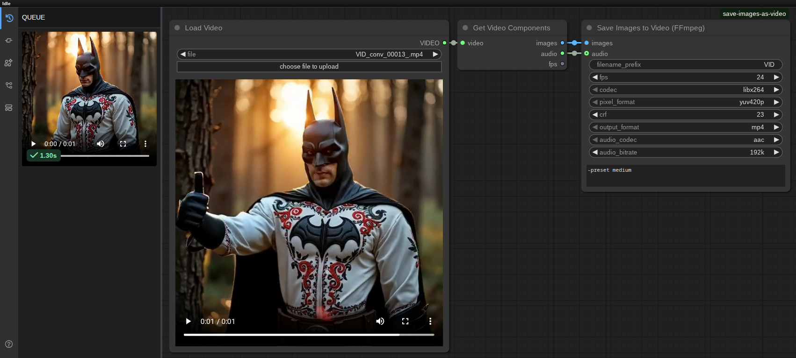
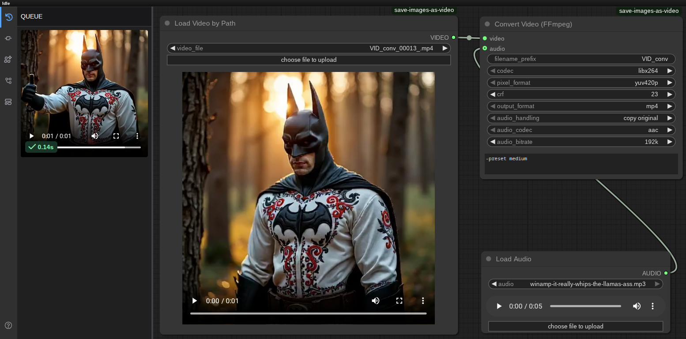
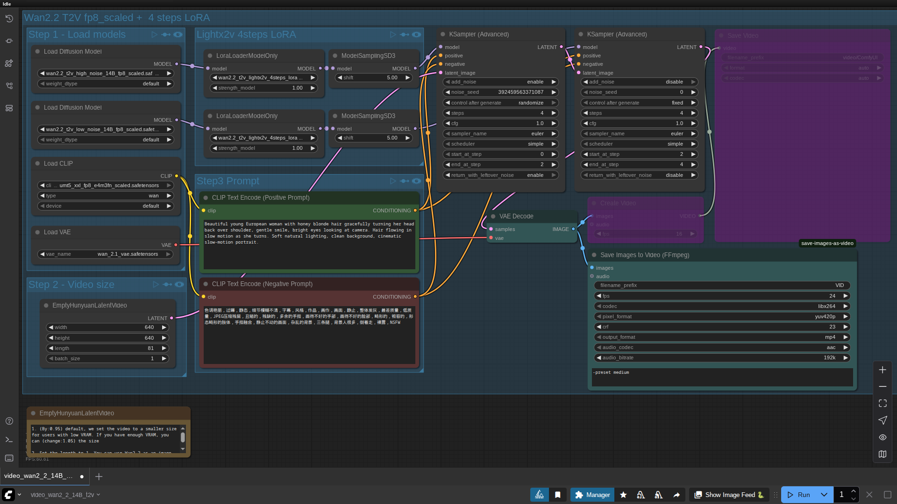

# Save Images to Video (FFmpeg) for ComfyUI

A custom node for ComfyUI to save image sequences as video files using FFmpeg. Supports various codecs and audio muxing.





## Features

*   **Save Images to Video**: Converts image sequences to MP4, WebM, MOV, AVI, MKV.
*   **Convert Video**: Re-encodes existing video files with different codecs and settings.
*   **Video Codecs**: libx264, libx265, mpeg4, libvpx-vp9, libsvtav1, and `copy` mode for converting.
*   **Configurable**: Set FPS, pixel format, CRF (quality), and custom FFmpeg parameters.
*   **Audio Support**: Mux existing audio, add new audio tracks, or remove audio. Supports AAC, MP3, libopus, and `copy`.

## Installation

1.  **Clone the repository:**
    ```bash
    cd ComfyUI/custom_nodes/
    git clone https://github.com/San4itos/ComfyUI-Save-Images-as-Video.git 
    cd ComfyUI-Save-Images-as-Video
    pip install -r requirements.txt
    ```
2.  **Get FFmpeg:**
    The node will automatically find FFmpeg in the following order:
    1.  **Custom Path (Recommended):** Edit `ffmpeg_config.ini` in the node's folder to point to your FFmpeg installation directory.
    2.  **Portable:** Place the `ffmpeg` executable inside the `ComfyUI-Save-Images-as-Video/ffmpeg_bin/` folder.
    3.  **System PATH:** If FFmpeg is installed and accessible in your system's PATH, it will be used as a fallback.

## Nodes

*   **Save Images to Video (FFmpeg)**: The main node to create a video from a sequence of images.
*   **Convert Video (FFmpeg)**: To re-encode or change the container of an existing video file.
*   **Load Video by Path**: Selects a video for the converter. Its output is only compatible with the `Convert Video (FFmpeg)` node.

Find the nodes in "Add Node" -> "San4itos".

## Usage
Connect an `IMAGE` output to the `images` input. Configure parameters as needed. Optionally connect an `AUDIO` input. For the conversion node, connect the output of the `Load Video by Path` node to the `VIDEO` input. While the converter can accept video from ComfyUI's default loader, this is inefficient as it forces an intermediate conversion to images. The `Load Video by Path` node is designed to pass the file path directly for a much faster re-encoding process.

You can view the generated videos in the ComfyUI queue by pressing the 'Q' key.

---

# Збереження Зображень у Відео (FFmpeg) для ComfyUI

Кастомний вузол для ComfyUI для збереження послідовностей зображень у відеофайли за допомогою FFmpeg. Підтримує різні кодеки та додавання аудіо.

## Можливості

*   **Збереження зображень у відео**: Конвертує послідовності зображень у MP4, WebM, MOV, AVI, MKV.
*   **Конвертація відео**: Перекодовує існуючі відеофайли з іншими кодеками та налаштуваннями.
*   **Відеокодеки**: libx264, libx265, mpeg4, libvpx-vp9, libsvtav1, та режим `copy` для конвертації.
*   **Гнучкі налаштування**: Встановлюйте FPS, формат пікселів, CRF (якість) та власні параметри FFmpeg.
*   **Підтримка аудіо**: Додавайте існуюче аудіо, нові аудіодоріжки або видаляйте звук. Підтримуються AAC, MP3, libopus, та `copy`.


## Встановлення

1.  **Клонуйте репозиторій:**
    ```bash
    cd ComfyUI/custom_nodes/
    git clone https://github.com/San4itos/ComfyUI-Save-Images-as-Video.git 
    cd ComfyUI-Save-Images-as-Video
    pip install -r requirements.txt
    ```
2.  **Встановіть FFmpeg:**
    Вузол автоматично знайде FFmpeg у наступному порядку:
    1.  **Власний шлях (Рекомендовано):** Відредагуйте `ffmpeg_config.ini` у папці вузла, щоб вказати шлях до вашої папки з FFmpeg.
    2.  **Портативний:** Розмістіть виконуваний файл `ffmpeg` у папці `ComfyUI-Save-Images-as-Video/ffmpeg_bin/`.
    3.  **Системний PATH:** Якщо FFmpeg встановлено та доступно у системному PATH, він буде використаний як запасний варіант.

## Вузли

*   **Save Images to Video (FFmpeg)**: Основний вузол для створення відео з послідовності зображень.
*   **Convert Video (FFmpeg)**: Для перекодування або зміни контейнера існуючого відеофайлу.
*   **Load Video by Path**: Обирає відео для конвертера. Його вихід сумісний лише з вузлом `Convert Video (FFmpeg)`.

Знайдіть вузли в "Add Node" -> "San4itos".

## Використання
Підключіть вихід `IMAGE` до входу `images`. Налаштуйте параметри за потребою. Опціонально підключіть вхід `AUDIO`. Для вузла конвертації з'єднайте вихід вузла `Load Video by Path` з входом `VIDEO`. Хоча конвертер може приймати відео від стандартного завантажувача ComfyUI, це неефективно, оскільки змушує виконувати проміжну конвертацію у зображення. Вузол `Load Video by Path` створений спеціально для прямої передачі шляху до файлу, що забезпечує набагато швидше перекодування.

Переглянути створені відео можна у черзі ComfyUI, натиснувши клавішу Q.
